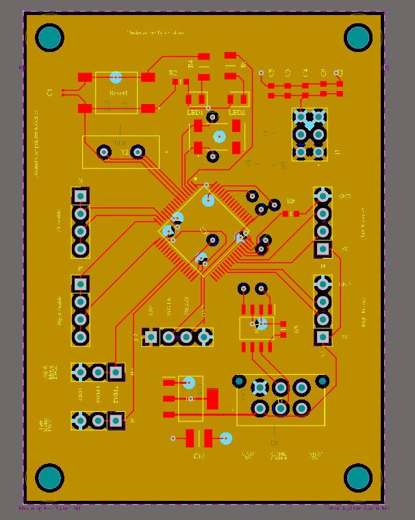

# STM32F103RCT6 Developement board

A stm32f103RCT6 Breakout board for Sooner Competitive Robotics and Personal use.

Contains PORTs for CAN-Bus protocol and a 6 pin molex power and signal connection.

## Major Components

1x [STM32f103RCT6 microcontroller](https://www.mouser.com/ProductDetail/STMicroelectronics/STM32F103RCT6?qs=%252BB84zevwoRA6TYzZIgOIoA%3D%3D)

1x [SN65HVD230QDR CAN transceiver](https://www.mouser.com/ProductDetail/Texas-Instruments/SN65HVD230QDR?qs=QViXGNcIEAvSeznLG41lqg%3D%3D)

1x [Molex Connector](https://www.molex.com/molex/products/part-detail/pcb_headers/0430450612)

## Minor Components

See bill of materials

## Designers

- Tyler Julian - Designer - [TylerJulian](https://github.com/tylerjulian)

## Built With

- Kicad and Altium- Schematic designed in Kicad then imported to Altium  

## Errata
* tbd
